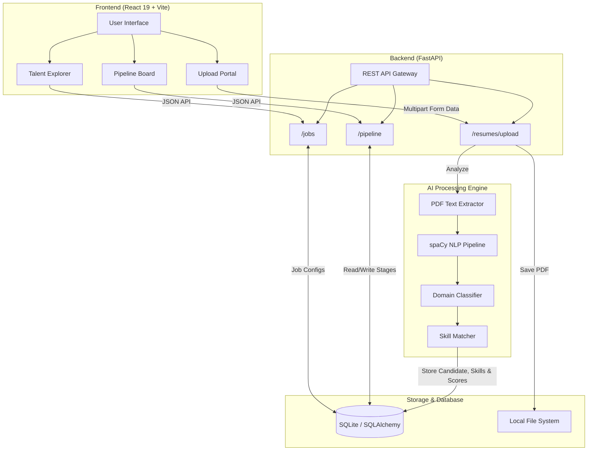

# 🏗️ Candiq Platform Architecture

**Version**: 1.0.0  
**System**: Resume Intelligence & Kanban Pipeline Platform  

---

## 1. System Architecture Overview

The system is built on a **Modern Hybrid AI Architecture** combining a robust Python/FastAPI backend with a lightning-fast React 19 frontend.

## 2. Core Modules

### 2.1 React 19 Frontend
- **Framework:** React 19 + Vite + TypeScript
- **Styling:** Tailwind CSS v4 + Framer Motion for micro-interactions
- **State Management:** Zustand (for global state) & React state
- **Routing:** React Router v7
- **UI Components:** Liquid Glass buttons, sleek dark-mode aesthetics, responsive Kanban drag-and-drop.

### 2.2 FastAPI Backend
- **Framework:** FastAPI + Pydantic v2
- **Database:** SQLAlchemy ORM with SQLite (easily portable to PostgreSQL).
- **Architecture Pattern:** Router -> Service -> Repository -> Model.

### 2.3 AI Pipeline Engine
1. **Document Ingestion:** Validates and standardizes uploaded PDFs.
2. **Feature Extraction:** NLP models extract structured skills, domain, and experience data.
3. **Scoring:** Calculates match rates between extracted Candidate Skills and Job Requirements.
4. **Auto-Assignment:** Direct integration with the Pipeline module to drop matching candidates straight into the `APPLIED` Kanban stage.

## 3. Data Flow: Auto-Pipeline Assignment

1. **Recruiter** selects a Job and uploads a batch of resumes in the Upload Portal.
2. **Frontend** POSTs multipart form data to `/api/v1/resumes/upload`.
3. **Backend AI** processes the PDF, creates a Candidate profile, extracts skills, and scores them.
4. **Backend** returns the parsed `candidate_id` back to the Frontend.
5. **Frontend** immediately POSTs to `/api/v1/pipeline/{job_id}/add` with the new `candidate_id` and the default stage (`applied`).
6. **Database** creates a new `PipelineEntry` and logs a `PipelineHistory` event.
7. **Recruiter** seamlessly sees the candidate appear in the Kanban board.
