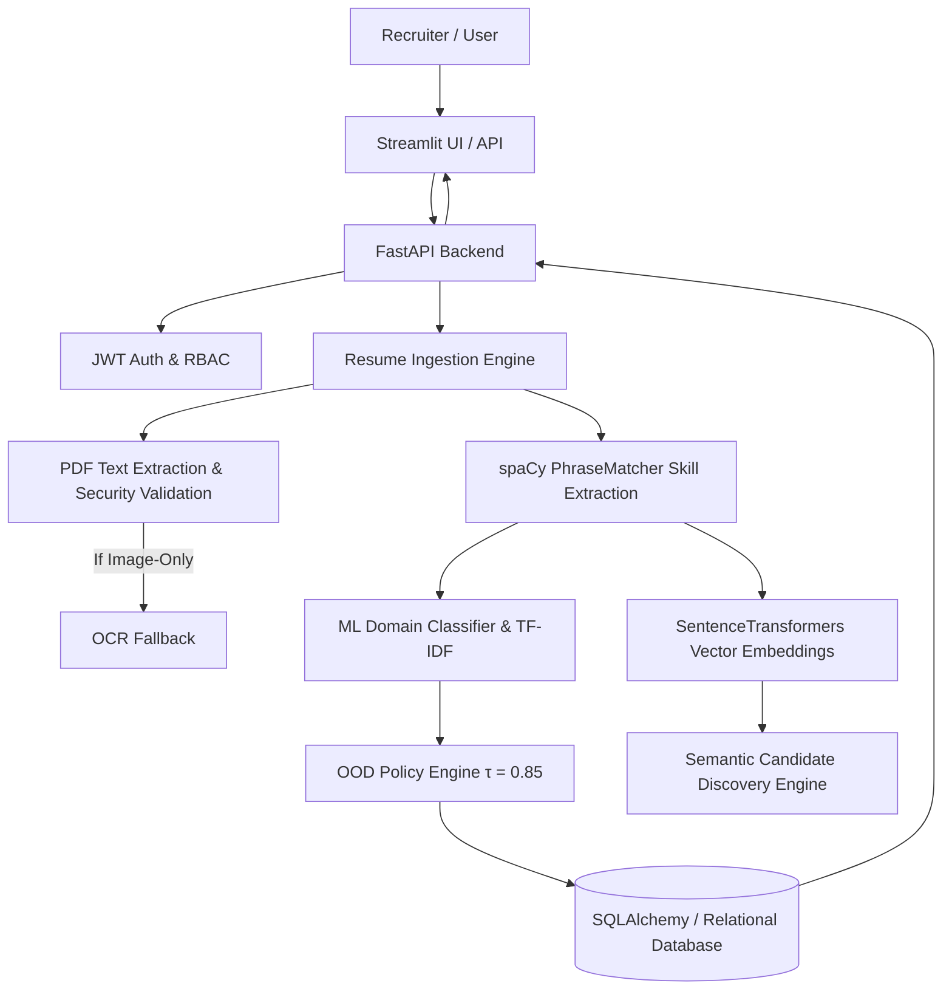
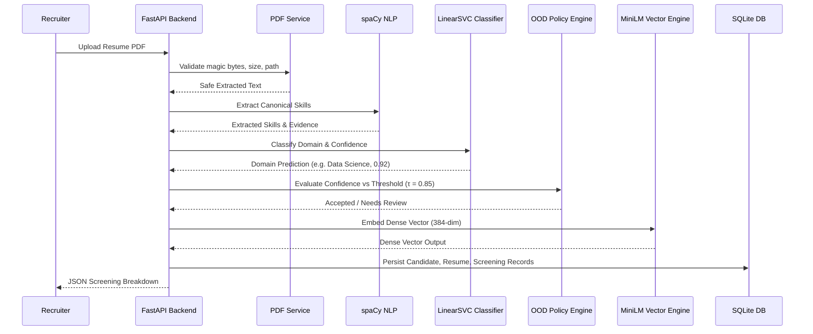

# 🎯 Candiq: Candidate Intelligence & AI-Powered Recruitment Platform

**Version**: 1.0.0 (Phase 38 Release Ready)
**Backend Framework**: Python 3.12 | FastAPI | SQLAlchemy 2.0
**Machine Learning**: Scikit-Learn (TF-IDF + Calibrated LinearSVC) | spaCy NLP
**Semantic Embeddings**: `sentence-transformers/all-MiniLM-L6-v2`
**Test Suite**: 299 / 299 Automated Tests Passing (100% Pass Rate across Phases 1–38)
**Model Integrity**: SHA-256 Checksum Verified (Zero Un-audited Mutations)

---

## 1. PROJECT OVERVIEW
**Candiq** is an AI-powered candidate intelligence and recruitment platform that automates resume understanding, candidate classification, skill matching, semantic candidate discovery, recruiter analytics, and AI-assisted hiring workflows. Built to automate candidate evaluation while eliminating black-box bias and un-audited automatic candidate rejection, Candiq combines deterministic NLP phrase matching, calibrated Scikit-Learn domain prediction models, an Out-Of-Domain (OOD) abstention policy engine, dense vector semantic search, multi-tenant RBAC security, production health observability, and real-time WebSocket pipeline telemetry.

Unlike generic resume parsers or LLM wrapper scripts, Candiq enforces **strict human-in-the-loop candidate protection**: out-of-domain resumes or low-confidence predictions are automatically assigned a `"Needs Manual Review"` status rather than being automatically rejected.



---

## 2. PROBLEM STATEMENT
Modern recruiter screening faces severe operational challenges:
1. **Manual Screening Overhead**: Recruiters spend 30–60 seconds per resume manually checking technical keywords and domain alignment.
2. **Brittle Keyword Parsing**: Traditional ATS regex parsers miss canonical skill synonyms (e.g. failing to recognize "GCP" as "Google Cloud Platform").
3. **Closed-World Model Risk**: Standard ML classifiers force every resume into a predefined class—mistakenly classifying a non-technical Accountant or Nurse as a "Web Developer" with artificial high confidence.
4. **Un-Ethical Automatic Rejection**: Automated ATS software that silently rejects candidates based on raw probability scores damages hiring pipelines and introduces algorithmic bias.

---

## 3. PROJECT OBJECTIVES
- **Deterministic Skill Ingestion**: Extract technical skills using spaCy PhraseMatcher without LLM hallucination risks.
- **Calibrated Multi-Class Domain Classification**: Predict canonical domains (`Data Science`, `Web Development`, `Cloud Computing`, `DevOps`, `Cybersecurity`) with Platt-scaled probability distributions.
- **Auditable OOD Abstention**: Implement a non-destructive OOD Policy Engine ($\tau = 0.85$) to flag uncertain predictions for manual review.
- **Deterministic 6-Signal Matching**: Rank candidate resumes using transparent, formula-driven weights (`35% Required Coverage + 15% Preferred Coverage + 25% Semantic Similarity + 10% Lexical Overlap + 10% Experience Depth + 5% Domain Alignment`).
- **Semantic Search & Discovery**: High-dimensional vector similarity (`all-MiniLM-L6-v2`) and natural language candidate search without overwriting deterministic screening scores.
- **Production Observability & Reliability**: Health probes (`/health/live`, `/health/ready`), request correlation tracing (`X-Request-ID`), structured logging, real runtime metrics, live database backup/recovery, and graceful shutdown.

---

## 4. CURRENT FEATURE MATRIX

| Feature | Status | Core Technology | Primary Code Path | Notes |
| :--- | :---: | :--- | :--- | :--- |
| **PDF Resume Ingestion** | **VERIFIED** | `pdfminer.six`, PyPDF | `backend/app/services/pdf_service.py` | Extension, magic bytes, max size, & path traversal validated. |
| **NLP Skill Extraction** | **VERIFIED** | spaCy (`en_core_web_sm`) | `backend/app/services/skill_service.py` | Matches canonical skills against `shared/skill_taxonomy.json`. |
| **ML Domain Classification** | **VERIFIED** | Scikit-Learn (LinearSVC) | `backend/app/services/classification_service.py` | Predicts 5 canonical tech categories with LRU caching. |
| **OOD Policy Engine** | **VERIFIED** | Pure Python Policy Engine | `backend/app/services/ood_policy.py` | Threshold $\tau = 0.85$, policy `v1.0-phase24-op4`. Non-destructive. |
| **Deterministic Job Matching** | **VERIFIED** | 6-Signal Match Engine | `backend/app/services/matching_service.py` | Calculates required/preferred coverage, lexical overlap, domain alignment. |
| **Semantic Embeddings** | **VERIFIED** | `sentence-transformers` (`all-MiniLM-L6-v2`) | `backend/app/services/embedding_service.py` | 384-dim dense vectors, CPU-compatible. |
| **Candidate Discovery** | **VERIFIED** | Vector Cosine + Relational Filters | `backend/app/services/discovery_service.py` | NL search, candidate similarity, job similarity, compare matrix. |
| **Generative AI & LLM** | **VERIFIED** | OpenAI / Gemini / Mock | `backend/app/services/ai_service.py` | Bullet rewriter, cover letter, interview kit, ATS analyzer. |
| **AI Resume Builder** | **VERIFIED** | Structured Draft Engine | `backend/app/services/resume_builder_service.py` | Target job ATS optimization, live match scoring, export. |
| **Recruiter Analytics** | **VERIFIED** | Real Database Aggregations | `backend/app/api/v1/analytics.py` | Pipeline breakdown, domain distribution, time-to-fill, OOD audit. |
| **Production Health & Metrics**| **VERIFIED** | FastAPI, MetricsCollector | `backend/app/routers/health.py` | Liveness, Readiness, Metrics, Database backup & recovery. |
| **Real-Time WebSockets** | **VERIFIED** | FastAPI WebSockets | `backend/app/services/websocket_manager.py` | Broadcasts real-time candidate processing events to UI. |

---

## 5. SYSTEM ARCHITECTURE & COMPONENT EXPLANATION

### Major Component Breakdown

#### FastAPI Backend (`backend/app/main.py`)
- **What**: Python ASGI web framework handling REST endpoints, WebSockets, rate limiting, and CORS.
- **Why**: Async execution, Pydantic schema validation, and OpenAPI documentation.
- **Flow**: Request $\rightarrow$ Request ID Middleware $\rightarrow$ JWT Auth & RBAC $\rightarrow$ Service Engine $\rightarrow$ Pydantic Schema.

#### PDF & Text Ingestion Engine (`backend/app/services/pdf_service.py`)
- **What**: Ingestion and validation engine for resume PDFs.
- **Why**: Safely extracts plain text without executing embedded macros or leaking file paths.
- **Flow**: Validates `%PDF` magic bytes $\rightarrow$ Saves under server-generated UUID $\rightarrow$ Extracts text via `pdfminer` $\rightarrow$ Triggers OCR fallback if text $< 50$ chars.

#### spaCy NLP Skill Matcher (`backend/app/services/skill_service.py`)
- **What**: PhraseMatcher NLP engine.
- **Why**: Zero-hallucination deterministic extraction of technical skills from text.
- **Flow**: Loads `en_core_web_sm` $\rightarrow$ Compares tokens against `skill_taxonomy.json` $\rightarrow$ Emits canonical skill objects.

#### Scikit-Learn Classifier & OOD Policy Engine (`classification_service.py` & `ood_policy.py`)
- **What**: ML domain classification and abstention decision wrapper.
- **Why**: Predicts domain class while guarding against out-of-domain false positives.
- **Flow**: `_load_model()` verifies SHA-256 hash $\rightarrow$ TF-IDF vectorization $\rightarrow$ Classifier probability prediction $\rightarrow$ OOD Policy check ($\tau = 0.85$) $\rightarrow$ Emits status (`accepted` vs `review`).

#### Deterministic 6-Signal Matching Engine (`matching_service.py`)
- **What**: Multi-factor candidate-job scoring algorithm.
- **Weights**: Required Skill Coverage (35%), Preferred Skill Coverage (15%), Semantic Similarity (25%), Lexical Token Overlap (10%), Experience Depth (10%), Domain Alignment Bonus (5%).

#### Candidate Discovery Engine (`discovery_service.py`)
- **What**: Vector semantic search and natural language discovery engine.
- **Flow**: Encodes query/resume using `all-MiniLM-L6-v2` $\rightarrow$ Computes cosine distance $\rightarrow$ Combines with relational filters (domain, coverage %, review status) $\rightarrow$ Emits Discovery Relevance Score (`discovery_relevance_score`).

---

## 6. RESUME PROCESSING PIPELINE & ML INTEGRITY



---

## 7. OOD (OUT-OF-DOMAIN) POLICY ENGINE
- **Threshold**: $\tau = 0.85$ (Frozen).
- **Behavior**: When the predicted top-class probability $P(\text{class} | x) < 0.85$, the model abstains from automatic domain assignment and sets `ood_status = "possible_out_of_domain"` and `status = "needs_review"`.
- **Candidate Protection**: Out-of-domain candidates are NEVER automatically rejected. They are routed to human recruiters for manual review.

---

## 8. SECURITY, MULTI-TENANCY & OBSERVABILITY

### Authentication & RBAC
- JWT Bearer token authentication with SHA-256 password hashing (`bcrypt`/`passlib`).
- Role-based permissions (`admin`, `hr`, `readonly`).
- Default admin credentials force password change on first login.

### Multi-Tenant Isolation
- Strict tenant boundary checking (`tenant_id`) across candidate records, jobs, screening results, and discovery APIs.

### Production Observability
- `GET /health/live`: Kubernetes liveness probe (200 OK).
- `GET /health/ready`: Checks Database, ML Model, Embedding Service, Storage.
- `GET /health/metrics`: Real-time performance latencies and request counters.
- `X-Request-ID`: Distributed tracing correlation header.

---

## 9. MODEL & DATASET SHA-256 CHECKSUM VERIFICATION

All model artifacts and processed dataset checksums remain strictly verified:
- `ml/artifacts/model_latest.joblib`: `0bce6bf763cf39f0b87780e43945f1bbbd80aa85a65da84a28bdfe681b4b60fb`
- `ml/artifacts/model_v2.joblib`: `6be329ae771bfba5a86bf1130669bdc54aac786768581ebc21e124561e6df4`
- `ml/data/processed/train.csv`: `24fd25a141efa2030394f46d48e206640dc24cba15d78e76ce92dd79e07fd0f0`
- `ml/data/processed/val.csv`: `ceaa476cf720437f42256a7b01cf43d9bcfb9b6c5bd9d16f06ef91e64a161ff6`
- `ml/data/processed/test.csv`: `10e456d0eed5a83c997b23ff0dac4cf95f8a234b3512835845d1fef410c331d4`

---

## 10. LOCAL SETUP & TESTING

### 1. Prerequisites
- Python 3.12+
- Virtual Environment

### 2. Backend Setup
```bash
cd backend
python -m venv .venv
.venv\Scripts\activate  # On Windows
pip install -r requirements.txt
python -m spacy download en_core_web_sm
uvicorn app.main:app --reload --port 8000
```

### 3. Frontend Setup
```bash
cd frontend
pip install -r requirements.txt
streamlit run app.py --server.port 8501
```

### 4. Running Tests
```bash
# Run all 307 backend tests
backend\.venv\Scripts\python.exe -m pytest backend/tests
```

---

## 11. DOCKER DEPLOYMENT
To run via Docker Compose:
```bash
docker-compose up --build
```
- **Backend API**: `http://localhost:8000`
- **Streamlit Frontend**: `http://localhost:8501`

---

## 12. KNOWN LIMITATIONS & PRODUCTION RECOMMENDATIONS
- **Database**: Default database is SQLite with WAL mode. For multi-node high-availability deployment, configure `DATABASE_URL` to managed PostgreSQL (`AWS RDS` or `GCP Cloud SQL`).
- **OCR Engine**: Tesseract OCR fallback is attempted for image-only PDFs when OS Tesseract binary is installed.
