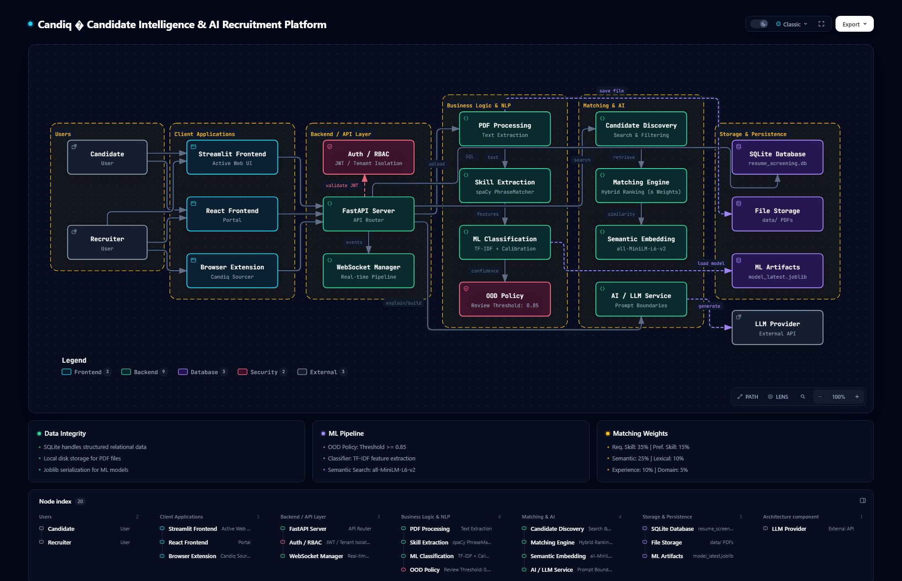

# Candiq

## Candidate Intelligence & AI-Powered Recruitment Platform

## System Architecture

Candiq is an AI-powered candidate intelligence and recruitment platform that processes resumes, extracts skills, classifies candidate domains, evaluates job fit, performs semantic candidate discovery, and provides recruiter-facing analytics and AI-assisted hiring workflows.

---

## Navigation
- [Overview](#overview)
- [Architecture](#system-architecture)
- [Features](#features)
- [ML Pipeline](#ml-pipeline)
- [Matching Engine](#matching-engine)
- [Candidate Discovery](#candidate-discovery)
- [AI Intelligence](#ai-intelligence)
- [Resume Builder](#resume-builder)
- [Security](#security)
- [Analytics](#analytics)
- [Deployment](#deployment)
- [Testing](#testing)
- [Limitations](#limitations)
- [Documentation](#documentation)

---

## Overview
Candiq automates resume understanding while eliminating black-box bias and un-audited automatic candidate rejection. It combines deterministic NLP phrase matching, calibrated Scikit-Learn domain prediction models, an Out-Of-Domain (OOD) abstention policy engine, dense vector semantic search, multi-tenant RBAC security, production health observability, and real-time WebSocket pipeline telemetry. 

Recently, the frontend was completely overhauled to feature a premium "Plum Peach Butter" aesthetic, heavily utilizing **Liquid Glass Button** interfaces, **Fluid GPU Backgrounds (DyeWhorl)**, and interactive navigation hubs for an unparalleled, state-of-the-art user experience.

## Features
- **Premium Animated UI**: Liquid glass distortion effects, SVG filters, fluid WebGL backgrounds, and interactive hover panels.
- **Real PDF resume processing**: Extracts text securely without executing embedded macros.
- **NLP skill extraction**: Deterministic extraction using spaCy PhraseMatcher.
- **5-domain ML classification**: Categorizes candidates into distinct tech domains.
- **Calibrated LinearSVC + TF-IDF**: 97.84% accuracy, 0.981 Macro F1 score.
- **OOD/abstention policy**: Configured threshold (0.85) catches uncertain resumes for manual human review.
- **Semantic embeddings**: Powered by ll-MiniLM-L6-v2 for 384-dimensional dense vector embeddings.
- **Hybrid candidate ranking**: 6-signal hybrid matching engine for deep candidate-job fit.
- **Candidate discovery**: Semantic search over candidate pools with structured filtering.
- **Recruiter workflow**: End-to-end recruiter dashboards, job creation, and candidate state management.
- **AI/LLM intelligence**: Prompt-defended LLM integration (OpenAI/Gemini/Mock) for explanations and cover letters.
- **AI Resume Builder**: Draft, refine, and optimize resumes against job descriptions.
- **Analytics**: Database aggregations showing pipeline breakdowns and domain distributions.
- **RBAC & Multi-tenancy**: Role-based access control and strict tenant scoping.
- **Security**: OAuth2/JWT token blocklisting, PII redaction, request correlation.
- **Production observability**: Active health probes, structured metrics.
- **WebSocket pipeline**: Real-time event broadcasting.
- **Docker deployment**: Easy containerization and startup.

## ML Pipeline
Raw resumes are vectorized using a frozen TF-IDF model and classified using a Calibrated Linear SVC across 5 technical domains. Low-confidence predictions fall below the OOD threshold and are routed to manual review.

## Matching Engine
- **Required Coverage**: 35%
- **Semantic Similarity**: 25%
- **Preferred Coverage**: 15%
- **Lexical Token Overlap**: 10%
- **Experience Depth**: 10%
- **Domain Alignment**: 5%

## Candidate Discovery
Uses Cosine Similarity on ll-MiniLM-L6-v2 embeddings alongside structured filters (domain, score, skills) to surface candidates without relying solely on deterministic keyword overlap.

## AI Intelligence
Integrates safely with external LLMs, ensuring prompts are structured carefully to protect against prompt injection while generating interview questions, summaries, and bullet points.

## Resume Builder
An interactive tool that allows candidates to draft resumes, get live ATS match scoring against specific jobs, and export polished PDFs.

## Security
Strict JWT validation, API rate limiting, SlowAPI integration, path traversal protection, and role-based endpoints (dmin, hr, 
eadonly).

## Analytics
Comprehensive metrics including Time-to-Fill, OOD counts, Domain Distribution, and Pipeline Funnel stages.

## Deployment
Packaged with docker-compose wrapping the FastAPI Uvicorn ASGI server and a Streamlit frontend.

## Testing
Comprehensive suite of 299 tests covering E2E processing, role escalation, ML classification, and security headers.

## Limitations
- Default database is SQLite. Migration to PostgreSQL is recommended for heavy production loads.
- Tesseract OCR fallback is attempted only when the local OS binary is present.

## Documentation
- [Architecture Details](docs/CANDIQ_ARCHITECTURE.md)
- [Development Guide](docs/DEVELOPMENT.md)
- [Technical Decisions](docs/TECHNICAL_DECISIONS.md)
