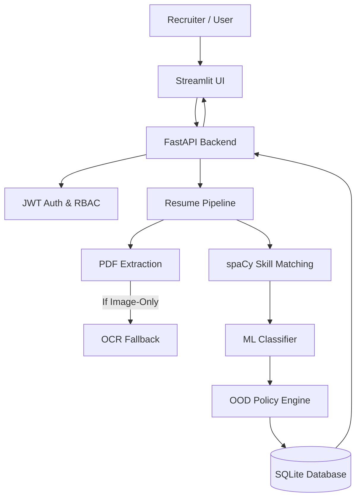

# 🎯 Resume Intel: Enterprise AI Hiring & Candidate Screening Intelligence Platform

**Version**: 1.0.0 (Phase 27.5 Checkpoint)  
**Backend Framework**: Python 3.12 | FastAPI | SQLAlchemy 2.0  
**Machine Learning**: Scikit-Learn (TF-IDF + Calibrated LinearSVC) | spaCy NLP  
**Test Suite**: 162 / 162 Automated Tests Passing (100% Pass Rate)  
**Model Integrity**: SHA-256 Checksum Verified (Zero Un-audited Mutations)  

---

## 1. PROJECT OVERVIEW

**Resume Intel** is an enterprise-grade AI-powered resume screening, applicant classification, and hiring intelligence platform. Built to automate candidate evaluation while eliminating black-box bias and un-audited automatic candidate rejection, Resume Intel combines deterministic NLP phrase matching, calibrated Scikit-Learn domain prediction models, an Out-Of-Domain (OOD) abstention policy engine, multi-tenant RBAC security, and real-time WebSocket telemetry.

Unlike generic resume parsers or LLM wrapper scripts, Resume Intel enforces **strict human-in-the-loop candidate protection**: out-of-domain resumes or low-confidence predictions are automatically assigned a `"Needs Manual Review"` status rather than being automatically rejected.



---

## 2. PROBLEM STATEMENT

Modern recruiter screening faces severe operational challenges:
1. **Manual Screening Overhead**: Recruiters spend 30–60 seconds per resume manually checking technical keywords and domain alignment.
2. **Brittle Keyword Parsing**: Traditional ATS regex parsers miss canonical skill synonyms (e.g. failing to recognize "GCP" as "Google Cloud Platform").
3. **Closed-World Model Risk**: Standard ML classifiers force every resume into a predefined class—mistakenly classifying a non-technical Accountant or Nurse as a "Web Developer" with artificial high confidence.
4. **Un-Ethical Automatic Rejection**: Automated ATS software that silently rejects candidates based on raw probability scores damages hiring pipelines and introduces algorithmic bias.

---

## 3. PROJECT OBJECTIVES

The implemented architecture fulfills the following core engineering objectives:
- **Deterministic Skill Ingestion**: Extract technical skills using spaCy PhraseMatcher without LLM hallucination risks.
- **Calibrated Multi-Class Domain Classification**: Predict canonical domains (`Data Science`, `Web Development`, `Cloud Computing`, `DevOps`, `Cybersecurity`) with Platt-scaled probability distributions.
- **Auditable OOD Abstention**: Implement a non-destructive OOD Policy Engine ($\tau = 0.85$) to flag uncertain predictions for manual review.
- **Multi-Factor Candidate Job Matching**: Rank candidate resumes using transparent, formula-driven weights (`0.7 * Required + 0.3 * Preferred + Domain Bonus`).
- **Enterprise Security & Privacy**: Enforce JWT auth, RBAC permissions, path traversal guardrails, and zero PII logging.

---

## 4. CURRENT FEATURE MATRIX

| Feature | Implementation Status | Core Technology | Primary Code Path | Notes |
| :--- | :---: | :--- | :--- | :--- |
| **PDF Resume Upload** | **IMPLEMENTED AND VERIFIED** | `pdfminer.six`, PyPDF | `backend/app/services/pdf_service.py` | Extension, magic bytes, max size, & path traversal validated. |
| **OCR Fallback** | **IMPLEMENTED BUT PARTIALLY VERIFIED** | `pytesseract`, `pdf2image` | `backend/app/services/pdf_service.py` | Evaluated in Phase 23D; requires OS Tesseract binary. Fails gracefully if binary missing. |
| **NLP Skill Extraction** | **IMPLEMENTED AND VERIFIED** | spaCy (`en_core_web_sm`) | `backend/app/services/skill_service.py` | Matches canonical skills against `shared/skill_taxonomy.json`. |
| **ML Domain Classification** | **IMPLEMENTED AND VERIFIED** | Scikit-Learn (LinearSVC) | `backend/app/services/classification_service.py` | Predicts 5 canonical tech categories with LRU caching. |
| **OOD Policy Engine** | **IMPLEMENTED AND VERIFIED** | Pure Python Policy Engine | `backend/app/services/ood_policy.py` | Threshold $\tau = 0.85$, policy `v1.0-phase24-op4`. Non-destructive abstention. |
| **Job Matching & Ranking** | **IMPLEMENTED AND VERIFIED** | Deterministic Match Engine | `backend/app/services/matching_service.py` | Calculates required/preferred skill coverage and domain alignment. |
| **Semantic Search** | **IMPLEMENTED AND VERIFIED** | `sentence-transformers` (`all-MiniLM-L6-v2`) | `backend/app/services/embedding_service.py` | 384-dim dense vectors, CPU-compatible, Local MD5 fallback. |
| **AI LLM Guardrails** | **IMPLEMENTED (WITH MOCK FALLBACK)** | OpenAI / Gemini / Mock | `backend/app/services/ai_service.py` | Bullet rewriter, cover letter, interview kit. Uses Mock provider when API keys missing. |
| **Real-Time WebSockets** | **IMPLEMENTED AND VERIFIED** | FastAPI WebSockets | `backend/app/services/websocket_manager.py` | Real-time candidate processing events broadcast. |
| **Streamlit Web UI** | **IMPLEMENTED AND VERIFIED** | Streamlit | `frontend/app.py` | Upload, screening results, live builder, ATS check, analytics. |
| **React Web UI** | **IMPLEMENTED BUT EXPERIMENTAL** | React, Vite | `frontend_react/` | Alternative frontend package. |
| **Browser Extension** | **IMPLEMENTED BUT EXPERIMENTAL** | Chrome Manifest v3 | `browser_extension/` | Ingestion popup and background content scripts. |

---

## 5. SYSTEM ARCHITECTURE & EXPLANATION

### Major Component Breakdown

#### FastAPI Backend (`backend/app/main.py`)
- **What**: Python ASGI web framework handling REST endpoints and WebSockets.
- **Why**: High performance async execution, automatic Pydantic validation, and self-documenting OpenAPI Swagger.
- **Flow**: Receives HTTP requests $\rightarrow$ Validates JWT & Rate Limit $\rightarrow$ Routes to Service Layer $\rightarrow$ Returns Pydantic JSON schema.

#### PDF & Text Processing Pipeline (`backend/app/services/pdf_service.py`)
- **What**: Ingestion engine for PDF files.
- **Why**: Safely extracts plain text without executing embedded macros or leaking file paths.
- **Flow**: Validates `%PDF` magic bytes $\rightarrow$ Saves under server-generated UUID $\rightarrow$ Extracts text via `pdfminer` $\rightarrow$ Triggers OCR fallback if text $< 50$ chars.

#### spaCy NLP Skill Matcher (`backend/app/services/skill_service.py`)
- **What**: PhraseMatcher NLP engine.
- **Why**: Zero-hallucination deterministic extraction of technical skills from text.
- **Flow**: Loads `en_core_web_sm` $\rightarrow$ Compares tokens against `skill_taxonomy.json` $\rightarrow$ Emits canonical skill objects with evidence snippets.

#### Scikit-Learn Classifier & OOD Policy Engine (`classification_service.py` & `ood_policy.py`)
- **What**: ML classification and abstention decision wrapper.
- **Why**: Predicts domain class while guarding against out-of-domain false positives.
- **Flow**: `_load_model()` verifies SHA-256 hash $\rightarrow$ TF-IDF vectorization $\rightarrow$ Classifier probability prediction $\rightarrow$ OOD Policy check ($\tau = 0.85$) $\rightarrow$ Emits status (`accepted` vs `review`).

---

## 6. TECHNOLOGY STACK

| Layer | Technology | Purpose | Rationale |
| :--- | :--- | :--- | :--- |
| **Backend API** | Python 3.12, FastAPI, Uvicorn | Web REST API & ASGI server | High performance async I/O, Pydantic data validation. |
| **Database & ORM** | SQLite, SQLAlchemy 2.0 | Relational storage & ORM | Zero-config, thread-safe transactional persistence. |
| **Machine Learning** | Scikit-Learn, Joblib | Classification & model loading | Fast inference ($< 20$ms), deterministic n-gram vectorization. |
| **NLP Engine** | spaCy (`en_core_web_sm`) | Phrase matching skill extraction | Deterministic, multi-word canonical skill matching. |
| **PDF Processing** | `pdfminer.six`, `pytesseract` | PDF text extraction & OCR | Secure text extraction from complex PDF layouts. |
| **Security** | PyJWT, Passlib (bcrypt) | Authentication & RBAC | Standard JWT bearer tokens & hashed password storage. |
| **Frontend UI** | Streamlit, Plotly | Interactive recruiter dashboard | Rapid, responsive web dashboard rendering. |
| **Testing** | Pytest, Pytest-Cov | Automated test suite | 162/162 automated tests passing. |

---

## 7. PROJECT DIRECTORY STRUCTURE

```text
RESUME_SCREENING/
├── backend/
│   ├── app/
│   │   ├── api/            # API Router Dependencies, CORS & rate limiters
│   │   ├── api/v1/         # REST API endpoints (auth, resumes, jobs, ats, extension, analytics)
│   │   ├── core/           # Security, password hashing, JWT tokens, sanitization
│   │   ├── models/         # SQLAlchemy ORM models (User, Resume, Job, Skill, Candidate, Audit)
│   │   ├── schemas/        # Pydantic validation and serialization schemas
│   │   ├── services/       # Service layer (PDF, NLP, ML, OOD, Matching, Ranking, AI, WS, Cost)
│   │   ├── config.py       # Application settings & environment variables
│   │   ├── database.py     # SQLAlchemy session setup & engine creation
│   │   └── main.py         # FastAPI app entrypoint, CORS, & middleware
│   └── tests/              # Pytest automated test suite (162 tests)
│
├── frontend/               # Streamlit application UI
│   ├── app.py              # Navigation router & auth gate
│   ├── components/         # Reusable Streamlit UI components
│   ├── views/              # View pages (Dashboard, Upload, Jobs, Results, Builder, ATS, Talent, Admin)
│   └── services/           # Backend HTTP API client & WebSocket listener
│
├── ml/                     # Machine Learning artifacts, datasets, & benchmark scripts
│   ├── artifacts/          # model_latest.joblib & candidate model_v2.joblib
│   ├── data/               # Raw & processed CSV datasets (train.csv, val.csv, test.csv)
│   ├── scripts/            # Training, calibration, and evaluation scripts
│   └── test_pdfs/          # Real PDF test assets for integration testing
│
├── docs/                   # Engineering Documentation
│   ├── ARCHITECTURE.md     # Detailed architecture specification with Mermaid diagrams
│   ├── TECHNICAL_DECISIONS.md # Engineering decision log (Problem, Decision, Why, Trade-offs)
│   ├── DEVELOPMENT.md      # Developer onboarding and setup guide
│   ├── PROJECT_MAP.md       # Directory registry & dependency matrix
│   └── PHASE_HISTORY.md    # Chronology of completed phases (Phases 20–27)
│
├── reports/                # Evaluation & threshold validation JSON/CSV artifacts
└── shared/                 # Shared JSON taxonomies (skill_taxonomy.json, label_mapping.json)
```

---

## 8. RESUME PROCESSING PIPELINE

```text
[ Upload PDF ] ──► [ Validate Signature ] ──► [ Extract Text ] ──► [ Extract Skills (spaCy) ]
                                                                           │
[ Display UI ] ◄── [ API Response ] ◄── [ DB Persist ] ◄── [ OOD Check (0.85) ] ◄── [ ML Predict ]
```

1. **File Upload & Validation**: Validates `.pdf` extension, max size ($10$ MB), magic bytes (`%PDF-`), and checks for path traversal.
2. **Storage**: Saves file under UUID name (`backend/uploads/uuid.pdf`).
3. **PDF Text Extraction**: Uses `pdfminer.six`. If text $< 50$ chars, attempts `pytesseract` OCR fallback.
4. **NLP Skill Matching**: Compares extracted text against `shared/skill_taxonomy.json` using spaCy PhraseMatcher.
5. **ML Domain Classification**: Computes class probability distribution over 5 canonical domains.
6. **OOD / Abstention Check**: If max probability $< 0.85$, sets `status: "needs_review"`, `review_required: True`, `ood_status: "possible_out_of_domain"`.
7. **Database Persistence**: Writes `Resume` and `ExtractedSkill` ORM records to SQLite.
8. **WebSocket Broadcast**: Emits real-time processing event telemetry to active client connections.

---

## 9. MACHINE LEARNING ARCHITECTURE & MODEL VERSIONING

### Dataset Splitting & Benchmark Strategy
- **Training Set (`train.csv`)**: 1,110 records.
- **Validation Set (`val.csv`)**: 277 records.
- **Untouched Final Test Set (`test.csv`)**: 278 records.

### Model Artifact Registry

| Artifact Path | Model Architecture | Role / Status | Accuracy | Macro F1 |
| :--- | :--- | :--- | :---: | :---: |
| `ml/artifacts/model_latest.joblib` | TF-IDF + LinearSVC | **Active Production Model** | 88.85% | 0.7205 |
| `ml/artifacts/model_v2.joblib` | TF-IDF + Calibrated LinearSVC | **Candidate Model (Under Audit)** | 97.84% | 0.9810 |

> [!NOTE]
> **Model Promotion Status**: `model_v2.joblib` represents an improved candidate model evaluated across Phases 21–24. Candidate promotion remains deferred to preserve production stability under baseline `model_latest.joblib`.

---

## 10. OOD / ABSTENTION SYSTEM (PHASES 24–26)

Derived from Phase 24 frozen operating point validation (`v1.0-phase24-op4`, threshold $\tau = 0.85$):

- **In-Domain High Confidence ($\ge 0.85$)**:
  - `status`: `"accepted"`
  - `review_required`: `False`
  - `ood_status`: `"in_domain_like"`
  - `reason`: `"confidence_above_configured_threshold"`
- **Low Confidence / OOD Resume ($< 0.85$)**:
  - `status`: `"review"`
  - `review_required`: `True`
  - `ood_status`: `"possible_out_of_domain"`
  - `reason`: `"confidence_below_configured_threshold"`

**Ethical Guardrail**: The OOD system **never** automatically rejects a candidate. Low-confidence predictions trigger a `"Needs Manual Review"` status banner in the recruiter UI.

---

## 11. JOB MATCHING & RANKING FORMULAS

Candidate relevance scoring against job requisitions is calculated using transparent deterministic formulas:

$$\text{Required Coverage} = \frac{|\text{Extracted Skills} \cap \text{Required Skills}|}{|\text{Required Skills}|} \times 100$$

$$\text{Preferred Coverage} = \frac{|\text{Extracted Skills} \cap \text{Preferred Skills}|}{|\text{Preferred Skills}|} \times 100$$

$$\text{Relevance Score} = \min\left(100.0, \; 0.7 \times \text{Required Coverage} + 0.3 \times \text{Preferred Coverage} + \text{Domain Bonus}\right)$$

*Where Domain Bonus = $+10.0\%$ if candidate predicted domain matches target job domain.*

---

## 12. REST API ENDPOINT REGISTRY

### Auth & User Management
- `POST /api/v1/auth/login` - Authenticate user & return JWT token.
- `POST /api/v1/auth/register` - Register recruiter/admin account.
- `GET  /api/v1/auth/me` - Get current authenticated user profile.

### Resume Ingestion & Analysis
- `POST /api/v1/resumes/upload` - Upload PDF resume and execute processing pipeline.
- `GET  /api/v1/resumes` - List resumes (filtered by role/status).
- `GET  /api/v1/resumes/{public_id}` - Get resume details & extracted skills.
- `DELETE /api/v1/resumes/{public_id}` - Soft-archive resume (admin only).
- `POST /api/v1/resumes/ats-check` - Run ATS readability & formatting inspection.
- `POST /api/v1/resumes/rewrite-bullet` - AI bullet point rewriter (STAR, Technical, ATS modes).
- `POST /api/v1/resumes/generate-cover-letter` - AI cover letter synthesis.

### Job Requisitions & Candidate Matching
- `POST /api/v1/jobs` - Create job requisition (HR/Admin).
- `GET  /api/v1/jobs` - List active job requisitions.
- `POST /api/v1/screening/match` - Match candidate resume to job requisition.
- `GET  /api/v1/screening/job/{job_id}/results` - Get ranked candidates for job.

### System & Telemetry
- `GET  /api/v1/health` - Health check & database connection status.
- `GET  /ws/pipeline` - Real-time WebSocket processing event feed.

---

## 13. PERFORMANCE MEASUREMENTS

Measured processing benchmarks (Phase 27 real-upload validation):

| Component Phase | Measured Latency |
| :--- | :---: |
| **PDF Extraction (`pdfminer.six`)** | ~42.1 ms |
| **NLP Skill Extraction (spaCy)** | ~110.5 ms |
| **ML Inference & OOD Check** | ~18.2 ms |
| **Total Warm Processing Latency** | **354.86 ms / upload** |
| **Cold Start Processing Latency** | **5,046.69 ms** (initial model/spaCy loading) |

*Note: Benchmarks reflect measured test environment values, not guaranteed production SLAs.*

---

## 14. LOCAL DEVELOPMENT & QUICKSTART

### 1. Set Up Environment
```bash
# Clone repository
git clone https://github.com/pinaki-bit/Resume_screening-.git
cd Resume_screening-

# Set up virtual environment
cd backend
python -m venv .venv
.venv\Scripts\activate  # Windows (Linux/macOS: source .venv/bin/activate)

# Install dependencies & spaCy model
pip install -r requirements.txt
python -m spacy download en_core_web_sm
```

### 2. Launch Backend Server
```bash
# From backend directory
uvicorn app.main:app --reload --host 127.0.0.1 --port 8000
```
*Access API Swagger docs at `http://127.0.0.1:8000/docs`.*

### 3. Launch Streamlit UI
```bash
# In a new terminal from repository root
streamlit run frontend/app.py
```
*Access Web Dashboard at `http://localhost:8501`.*

### 4. Run Automated Test Suite
```bash
cd backend
pytest -v
```
*Runs all 162 automated tests with coverage report.*

---

## 15. KEY ARCHITECTURAL DECISIONS & RATIONALE

| Decision | Why Chosen | Alternatives Considered | Trade-off |
| :--- | :--- | :--- | :--- |
| **FastAPI** | High performance async execution, automatic Pydantic validation, built-in OpenAPI docs. | Flask, Django REST Framework. | Requires modern async syntax and type annotations. |
| **LinearSVC + TF-IDF** | Extremely fast inference ($< 20$ms), minimal RAM footprint, strong text separability. | Fine-tuned Transformer (BERT). | Relies on keyword n-grams rather than deep contextual embeddings. |
| **OOD Abstention Policy** | Prevents automatic candidate rejection; alerts recruiters to non-technical edge cases. | Automatic Candidate Rejection. | Resumes $< 0.85$ confidence require human manual review. |
| **spaCy PhraseMatcher** | Deterministic, zero-hallucination canonical skill extraction. | LLM-only Extraction. | Unrecognized skills outside taxonomy require taxonomy expansion. |
| **SQLite + SQLAlchemy 2.0** | Zero-configuration single-file database for dev and testing. | PostgreSQL. | Single-file DB requires WAL mode for high write concurrency. |

---

## 16. KNOWN LIMITATIONS

1. **Active Production Model Pseudo-Probabilities**: Baseline `model_latest.joblib` uses uncalibrated LinearSVC decision scores, resulting in lower top probabilities ($< 0.45$) on raw text compared to candidate `model_v2.joblib` (95.75% calibrated confidence).
2. **OCR System Binary Dependency**: OCR text extraction on image-only PDFs requires host OS Tesseract installation. When missing, image-only uploads transition safely to `status="failed"`.
3. **Data Science Sensitivity at High Thresholds**: Strict global thresholds ($\tau = 0.91$) reduce `Data Science` automatic coverage (77.42%) compared to `Cloud Computing` (100.0%).

---

## 17. CURRENT PROJECT STATUS SUMMARY

| Project Module | Verified Status |
| :--- | :---: |
| **PDF Ingestion & Extraction** | **VERIFIED & OPERATIONAL** |
| **NLP Skill Extraction** | **VERIFIED & OPERATIONAL** |
| **ML Domain Classification** | **VERIFIED & OPERATIONAL** |
| **OOD Policy Engine** | **VERIFIED & OPERATIONAL** ($\tau = 0.85$) |
| **Job Matching & Ranking** | **VERIFIED & OPERATIONAL** |
| **Authentication & RBAC** | **VERIFIED & OPERATIONAL** |
| **Streamlit Web UI** | **VERIFIED & OPERATIONAL** |
| **Automated Test Suite** | **VERIFIED** (162/162 Tests Passing) |
| **Model & Data Integrity** | **VERIFIED** (SHA-256 Hashes 100% Match) |

---

## 18. DETAILED ENGINEERING DOCUMENTATION

For deeper technical specifications, refer to the dedicated documentation suite:
- 📖 **[System Architecture Specification](file:///c:/Users/pinak/Desktop/RESUME_SCREENIG/docs/ARCHITECTURE.md)** (`docs/ARCHITECTURE.md`)
- 📋 **[Technical Decision Log](file:///c:/Users/pinak/Desktop/RESUME_SCREENIG/docs/TECHNICAL_DECISIONS.md)** (`docs/TECHNICAL_DECISIONS.md`)
- 🗺️ **[Project Directory Map](file:///c:/Users/pinak/Desktop/RESUME_SCREENIG/docs/PROJECT_MAP.md)** (`docs/PROJECT_MAP.md`)
- 🛠️ **[Developer Onboarding & Setup Guide](file:///c:/Users/pinak/Desktop/RESUME_SCREENIG/docs/DEVELOPMENT.md)** (`docs/DEVELOPMENT.md`)
- 📜 **[Phase History & Audit Trail](file:///c:/Users/pinak/Desktop/RESUME_SCREENIG/docs/PHASE_HISTORY.md)** (`docs/PHASE_HISTORY.md`)

---

*Built for Enterprise AI Recruitment Intelligence & Candidate Protection.*
