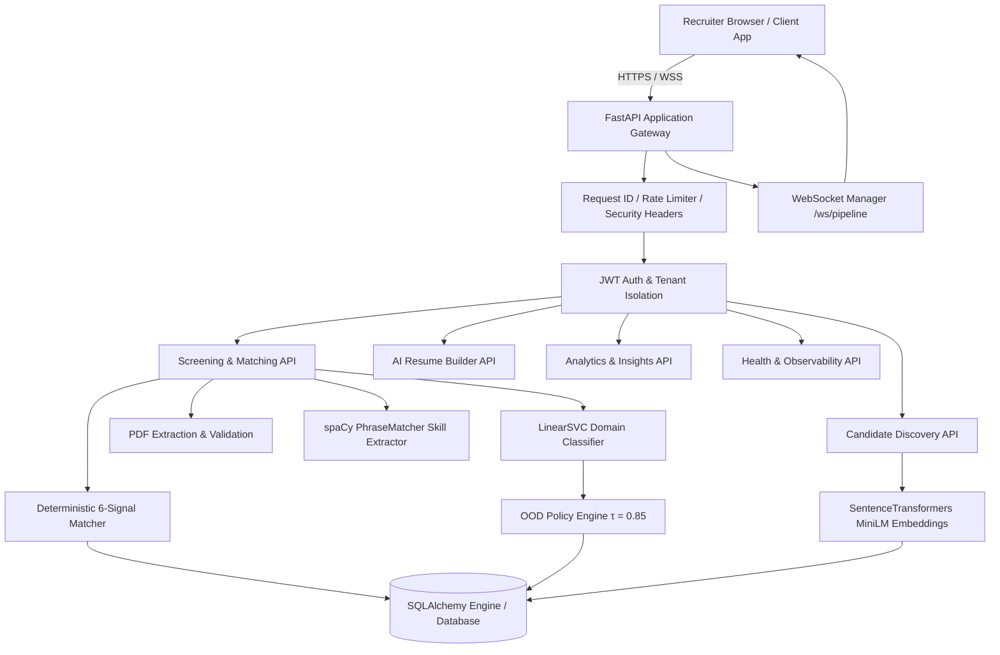

# SYSTEM ARCHITECTURE DOCUMENTATION

## 1. High-Level System Architecture
**Candiq** is structured as a decoupled, layered micro-architecture comprising a FastAPI asynchronous REST & WebSocket backend, an offline ML training and calibration pipeline, an NLP entity extraction engine, a dense vector semantic discovery layer, and a Streamlit recruiter web workspace.

---

## 2. Core Service Components
1. **PDF Service (`pdf_service.py`)**: File magic byte validation (`%PDF`), UUID filename mapping, text extraction via `pdfminer.six`, and OCR fallback via `tesseract`.
2. **Skill Service (`skill_service.py`)**: Deterministic NLP skill extraction using spaCy `en_core_web_sm` against `shared/skill_taxonomy.json`.
3. **Classification Service (`classification_service.py`)**: TF-IDF vectorization + Platt-calibrated LinearSVC predicting 5 domain categories (`Data Science`, `Web Development`, `Cloud Computing`, `DevOps`, `Cybersecurity`).
4. **OOD Policy Engine (`ood_policy.py`)**: Non-destructive abstention engine ($\tau = 0.85$). Routes low-confidence predictions to human review.
5. **Matching Service (`matching_service.py`)**: Deterministic 6-signal hybrid matching engine (`35%` Required Coverage, `15%` Preferred Coverage, `25%` Semantic Similarity, `10%` Lexical Overlap, `10%` Experience Depth, `5%` Domain Alignment).
6. **Embedding Service (`embedding_service.py`)**: Dense 384-dimensional vector encoding (`all-MiniLM-L6-v2`) for semantic similarity and candidate discovery.
7. **Discovery Service (`discovery_service.py`)**: Vector cosine search, skill filter intersection, and factual side-by-side candidate comparison matrix.
8. **Generative AI Service (`ai_service.py`)**: Multi-provider generative AI abstraction (OpenAI, Gemini, Mock) for resume rewriting, cover letters, interview kits, and ATS scoring.
9. **Metrics & Backup (`metrics.py`, `backup_service.py`)**: Real-time latency tracking, request correlation tracing, and SQLite online backup API with quick check verification.

---

## 3. Database & Persistence Layer
- **ORM**: SQLAlchemy 2.0.
- **SQLite Engine**: Configured with Write-Ahead Logging (`PRAGMA journal_mode=WAL`) and Foreign Key enforcement (`PRAGMA foreign_keys=ON`).
- **PostgreSQL Readiness**: Full dialect compatibility via `DATABASE_URL` env variable for multi-node deployments.
