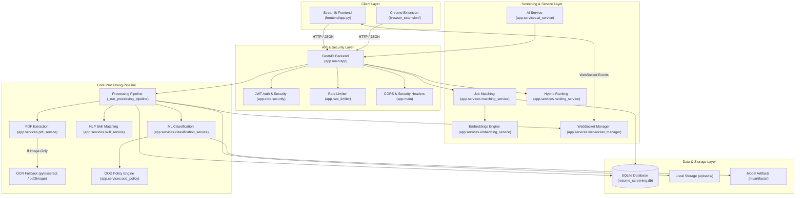
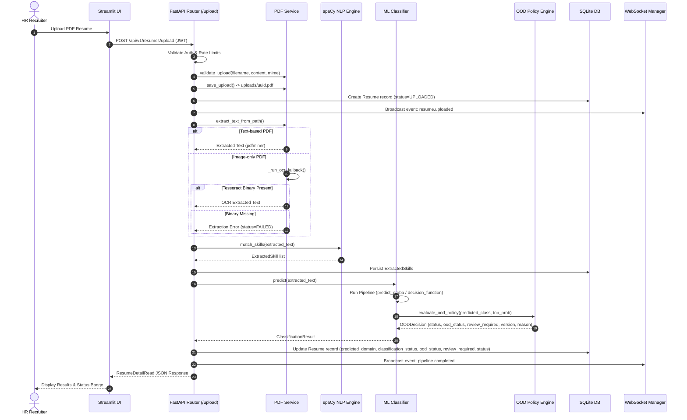
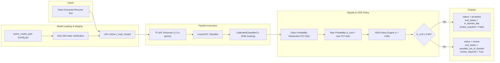
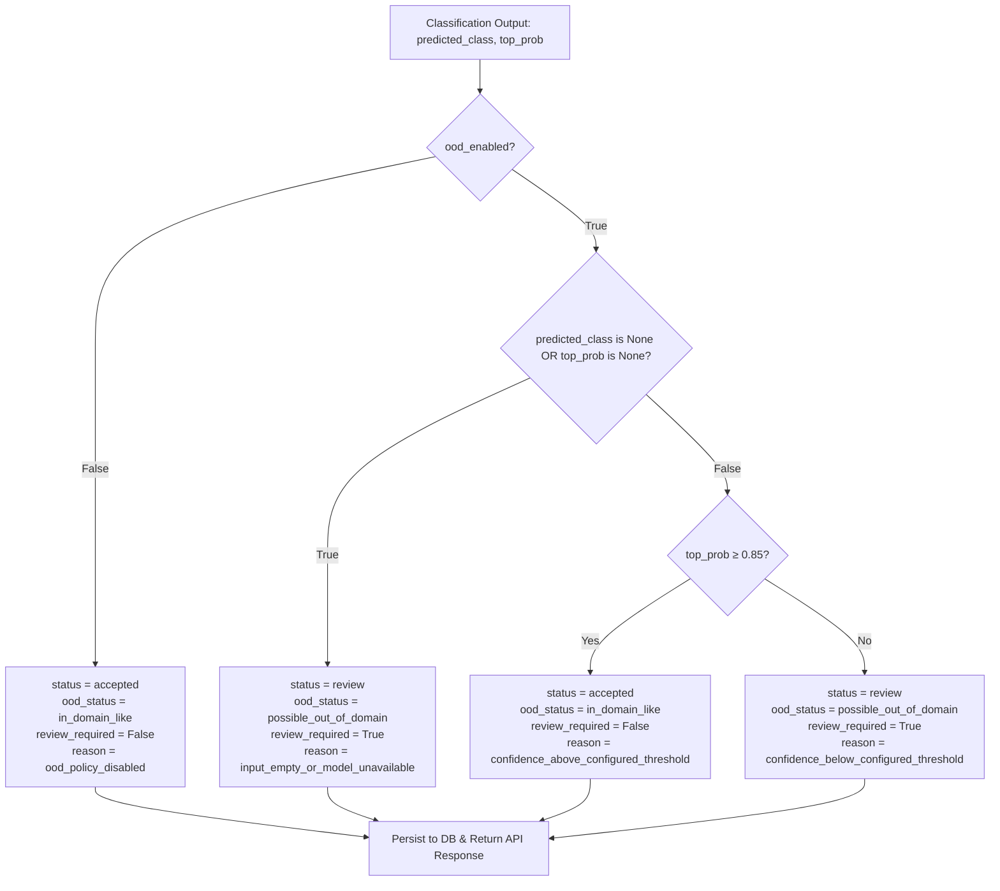
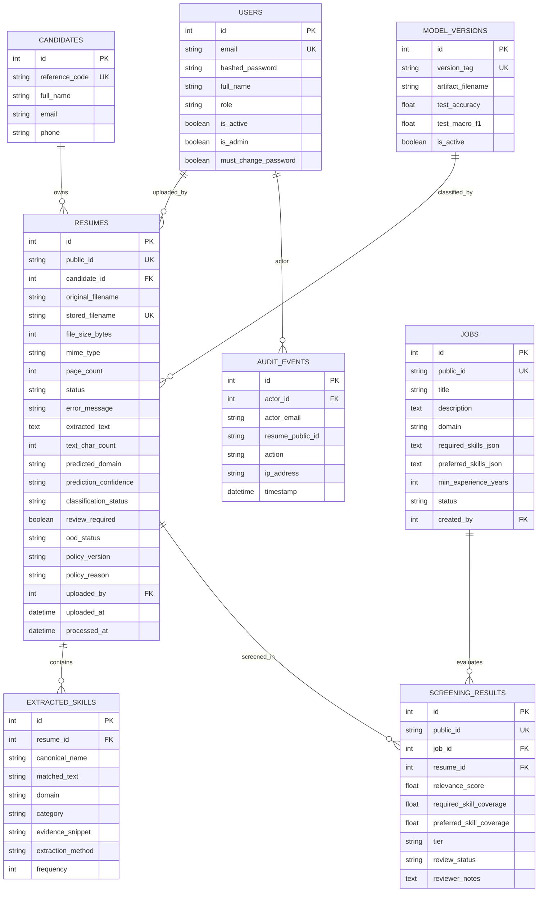

# RESUME INTEL — SYSTEM ARCHITECTURE SPECIFICATION

**Project**: Resume Intel  
**Document Version**: 1.0 (Phase 27.5 Checkpoint)  
**Date**: September 28, 2026  

---

## 1. HIGH-LEVEL SYSTEM ARCHITECTURE

Resume Intel is built on a decoupled, modular service-oriented architecture designed to separate HTTP API handling, Natural Language Processing (NLP), Machine Learning (ML) inference, Out-Of-Domain (OOD) policy evaluation, and frontend UI presentation.



---

## 2. RESUME PROCESSING SEQUENCE

The sequence below illustrates the step-by-step processing of a PDF resume upload through the application:



---

## 3. MACHINE LEARNING INFERENCE & CALIBRATION PIPELINE

The ML inference subsystem operates independently from model training:



---

## 4. OOD / ABSTENTION DECISION FLOW

The OOD abstention policy enforces a strict non-destructive rule: **Abstention means "Needs Manual Review", NOT "Candidate Rejected"**.



---

## 5. AUTHENTICATION & RBAC FLOW

Request security is enforced using JWT Bearer authentication and role-based access boundaries:

```mermaid
flowchart TD
    REQ["HTTP Request"] --> HEADER["Authorization Header (Bearer JWT)"]
    HEADER --> DEC["Decode & Validate JWT (app.core.security)"]
    DEC -->|Invalid / Expired| ERR401["HTTP 401 Unauthorized"]
    DEC -->|Valid| ROLE["Extract User Role (admin | hr | readonly)"]
    
    ROLE --> ROUTE{"Target Endpoint Permission"}
    
    ROUTE -->|Admin Only (/admin/*)| CHK_ADM{"role == admin?"}
    CHK_ADM -->|Yes| OK["Execute Route Handler"]
    CHK_ADM -->|No| ERR403["HTTP 403 Forbidden"]
    
    ROUTE -->|HR & Admin (/resumes/upload)| CHK_HR{"role in (hr, admin)?"}
    CHK_HR -->|Yes| OK
    CHK_HR -->|No| ERR403
    
    ROUTE -->|Authenticated View (/resumes/{id})| OK
```

---

## 6. DATABASE RELATIONSHIP DIAGRAM (ERD)

The database schema manages candidates, resumes, extracted skills, job requisitions, screening matches, and audit logs:



---

## 7. COMPONENT SPECIFICATIONS

### 7.1 Backend Services Directory (`backend/app/services/`)
- `pdf_service.py`: PDF validation (extension, size, magic bytes), storage under UUID name, text extraction via `pdfminer.six`, and OCR fallback via `pytesseract`.
- `skill_service.py`: NLP skill extraction using spaCy `en_core_web_sm` PhraseMatcher against `shared/skill_taxonomy.json`.
- `classification_service.py`: LRU-cached model loading, SHA-256 sidecar integrity verification, classifier prediction execution (`predict`), and OOD policy integration.
- `ood_policy.py`: Non-destructive abstention decision engine ($\tau = 0.85$, policy `v1.0-phase24-op4`).
- `matching_service.py`: Multi-factor deterministic candidate-job skill coverage and domain bonus score calculation.
- `ranking_service.py`: Hybrid candidate ranking combining skill match score, domain alignment, and ATS compatibility.
- `embedding_service.py`: Hashing / TF-IDF vector similarity engine for semantic matching fallback.
- `ai_service.py`: LLM abstraction provider (`MockAIProvider`, OpenAI, Gemini) for bullet rewriting, cover letter generation, and interview kits with factual guardrails.
- `websocket_manager.py`: Async WebSocket connection manager broadcasting real-time resume processing telemetry.
