# FINAL SYSTEM FLOW — CANDIQ

This document illustrates the end-to-end data flow and architectural execution path within **Candiq**, from user resume submission to recruiter analytics.

---

## Complete End-to-End System Flowchart

```mermaid
flowchart TD
    A[USER / RECRUITER] -->|1. Submit Resume PDF / Actions| B[FRONTEND UI - Streamlit / React]
    B -->|2. HTTP POST with Bearer JWT| C[AUTHENTICATION GATE - OAuth2 / JWT]
    C -->|3. Validated Token & Tenant Context| D[FASTAPI BACKEND - Router Layer]
    
    subgraph INGESTION_PIPELINE ["Ingestion & Preprocessing"]
        D -->|4. Receive Upload Stream| E[RESUME UPLOAD SERVICE]
        E -->|5. Extension, Magic Bytes & Size Check| F[PDF VALIDATION - pdf_service.py]
        F -->|6. Extract Text & Ligature Norm| G[TEXT EXTRACTION - pdfminer.six]
    end

    subgraph INTELLIGENCE_PIPELINE ["Intelligence & Classification Engine"]
        G -->|7. spaCy Entity & Lemma Stream| H[NLP / SKILL EXTRACTION - skill_service.py]
        H -->|8. TF-IDF 50k Unigram Features| I[ML CLASSIFICATION - LinearSVC + CalibratedCV]
        I -->|9. Compare Top Probability vs 0.85| J[OOD CHECK - ood_policy.py OP-4]
    end

    subgraph PERSISTENCE_MATCHING ["Persistence & Hybrid Match Engine"]
        J -->|10. Persist Candidate, Skills, Screening| K[CANDIDATE STORAGE - DB SQLAlchemy ORM]
        K -->|11. Compare candidate vs Job Skills| L[JOB MATCHING - Required 70% / Preferred 30%]
        L -->|12. 6-Signal Composite Scoring| M[HYBRID RANKING - matching_service.py]
        M -->|13. MiniLM-L6-v2 Vector Embeddings| N[SEMANTIC SEARCH - embedding_service.py]
    end

    subgraph RECRUITER_INTELLIGENCE ["Recruiter Workflow & AI Tools"]
        N -->|14. Display Ranked Candidates & Badges| O[RECRUITER DASHBOARD - views/results.py]
        O -->|15. Prompt-Defended LLM Generation| P[AI INTELLIGENCE - ai_service.py]
        P -->|16. Aggregate Hiring Metrics & Exports| Q[ANALYTICS & REPORTING - analytics.py]
    end
```

---

## Detailed Stage Breakdown

### 1. USER
The user (Recruiter, Hiring Manager, or Candidate) interacts with the system through the web frontend interface.

### 2. FRONTEND UI
Built with Streamlit (HUD design system) or React SPA. Handles user state, JWT access token storage in session, batch file upload UI, and dynamic result rendering.

### 3. AUTHENTICATION
Validates the incoming HTTP `Authorization: Bearer <token>` header. Decodes the JWT signed with `HS256`, verifies it against `TokenBlocklist`, and attaches `current_user` and `tenant_id` to the request context.

### 4. FASTAPI BACKEND
FastAPI (`backend/app/main.py`) routes incoming requests, applies rate limiting (SlowAPI), logs latency via `X-Request-ID` correlation middleware, and delegates business logic to specialized services.

### 5. RESUME UPLOAD
`backend/app/api/v1/resumes.py` receives the multipart form upload stream.

### 6. PDF VALIDATION
`pdf_service.py` executes 4 security checks:
- Extension check (must be `.pdf`).
- File magic bytes signature check (`b"%PDF"`).
- Maximum file size check (10MB).
- Path traversal check on filename.
Saves the binary content under a server-generated UUID filename.

### 7. TEXT EXTRACTION
`pdfminer.six` extracts stream text and page counts. Normalizes ligatures (`\ufb01` -> `fi`), cleans inline spacing, and collapses excessive line breaks. Attempts Tesseract OCR fallback if text is under 50 characters.

### 8. NLP / SKILL EXTRACTION
`nlp_service.py` and `skill_service.py` execute spaCy NER (extracting `ORG` and `DATE`) and run a spaCy `PhraseMatcher` (`attr="LOWER"`) against `shared/skill_taxonomy.json`. Outputs canonical skill matches, categories, frequencies, and 200-character evidence context snippets.

### 9. ML CLASSIFICATION
`classification_service.py` transforms cleaned text into a 50,000-feature TF-IDF unigram vector and passes it to `CalibratedClassifierCV(LinearSVC)`. Generates predicted technical domain and Platt-calibrated probability distributions over 5 classes.

### 10. OOD CHECK
`ood_policy.py` evaluates the top class probability against the frozen Phase 24 OP-4 confidence threshold (**`0.85`**).
- If `top_probability >= 0.85`: Candidate flagged as `in_domain_like` (`review_required=False`).
- If `top_probability < 0.85`: Candidate flagged as `possible_out_of_domain` (`review_required=True` / "Needs Manual Review").

### 11. CANDIDATE STORAGE
SQLAlchemy ORM writes `Candidate`, `Resume`, `ExtractedSkill`, and `ScreeningResult` records to the database (`resume_screening.db` / PostgreSQL) in an atomic transaction scoped by `tenant_id`.

### 12. JOB MATCHING
`matching_service.py` evaluates candidate skills against target `JobRequirement` records. Computes Required Skill Coverage (70% weight) and Preferred Skill Coverage (30% weight), generating an explicit missing skills list.

### 13. HYBRID RANKING
`compute_hybrid_match` calculates a composite score using 6 weighted signals:
- Required Skill Coverage (35%)
- Preferred Skill Coverage (15%)
- Semantic Similarity (25%)
- Lexical Overlap Jaccard (10%)
- Experience Depth (10%)
- Domain Alignment (5%)

### 14. SEMANTIC SEARCH
`embedding_service.py` uses `sentence-transformers/all-MiniLM-L6-v2` to compute 384-dimensional dense vector embeddings for resume text and job descriptions, calculating normalized cosine similarity.

### 15. RECRUITER DASHBOARD
Recruiter views ranked candidate lists, filters by OOD review status, inspects interactive score breakdowns, and updates candidate hiring statuses (`shortlisted`, `rejected`).

### 16. AI INTELLIGENCE
`ai_service.py` generates prompt-defended AI candidate match summaries, tailored 5-question interview kits, and ATS bullet optimizations using Mock, OpenAI, or Gemini providers with PII redaction and `DATA_BOUNDARY` tags.

### 17. ANALYTICS
`analytics.py` aggregates platform metrics: domain distribution percentages, skill demand vs supply gap matrix, screening throughput over time, and confidence level histograms, providing CSV and JSON export capabilities.
